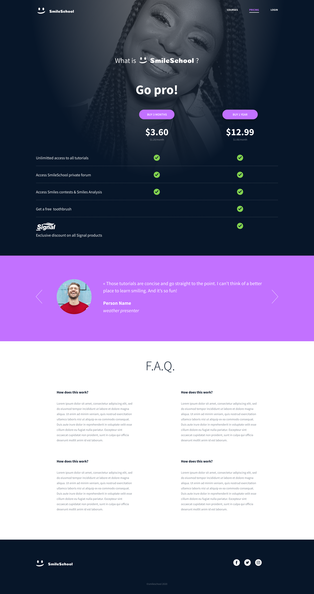
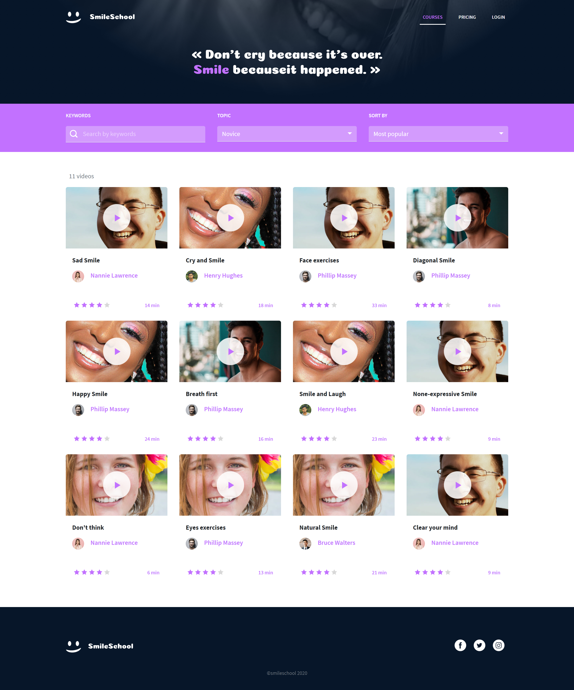

## Description

In this project, I implemented 3 web pages with Bootstrap and make some parts dynamic with Javascript (JQuery exactly). I used all HTML/CSS/Accessibility/Responsive design/Bootstrap/Javascript knowledges that I learned previously
and I was free to implement it the way I wanted.

---
## Content
#### 0. Reuse and polish your Bootstrap integration --> [Homepage HTML file](./0-homepage.html) | [Pricing HTML file](./0-pricing.html) | [Courses HTML file](./0-courses.html) | [CSS file](./styles.css)
#### 1. Homepage - quotes --> [HTML file](./1-homepage.html)
#### 2. Homepage - popular tutorials --> [HTML file](./2-homepage.html)
#### 3. Homepage - latest videos --> [HTML file](./homepage.html)
#### 4. Pricing - quotes --> [HTML file](./pricing.html)
#### 5. Courses --> [HTML file](./courses.html)

### Homepage

### Pricing page
 
### Courses page

---

## Author
#### Luz Sánchez Bolaños
- Github: [zulsb](https://github.com/zulsb)
- Twitter: [@LuzSanchezB](https://twitter.com/LuzSanchezB)

Cohort 10 | Cali, Colombia 2020